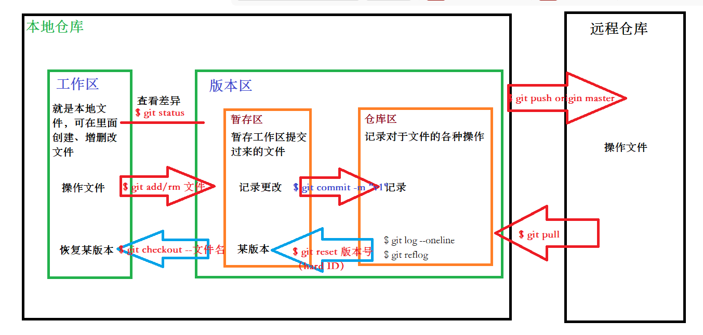

[toc]




# github 使用

```bash
git init
git add
git commit -m "first commit"
//创建分支
git branch 
git remote add origin [仓库链接]
//如果不是第一次提交git push origin 【分支名】
git push -u origin 【分支名】

//切换分支进行操作
git checkout 分支名
//合并到当前工作分支上
git merge 分支名
```

### 如果第一次安装github，那么要进行以下配置

```bash
git config --global user.email "you@examole.com"
git config --globe user.name "Your name"
```

### 查看提交日志

commit 字段后的是hard ID，可用于回滚。

```bash
git log
```

### 查看文件下所有文件的状态

```bash
git status
```

### 测试ssh连接是否成功

```bash
ssh -T git@gitee.com
```

### 回滚操作

hard ID的获取见git log操作。

```bash
git reset --hard ID
```

### 下载代码到本地

如果是第一次下载代码，

```bash
git clone 【仓库名】
```

如果是已经下载过，只是在分支上进行过修改，现在想继续修改，需要更新dev分支

```bash
git pull -u origin 【分支名】
```

### git rebase

1. 合并操作记录
2. 变基合并操作记录
3. 假如在公司写了一段代码，但是忘了提交到远程仓库，回家又写一段代码，这次吸取教训及时提交到远程仓库，第二天到公司跟之前的那段代码进行合并，如果直接执行git pull可能会有冲突，除非是在家写的代码跟在公司写的代码没有交集。如果出现这种情况，可以使用rebase进行操作。这样相较于merge的不同之处就是不会出现分支，直接加到主干上。

其实git pull相对于两步操作，第一步git fetch，第二步git merge

```bash
git rebase dev
git rebase master
```

如果出现冲突，就需要进行手动解决，然后

```bash
git add xxx
git rebase --continue
```
